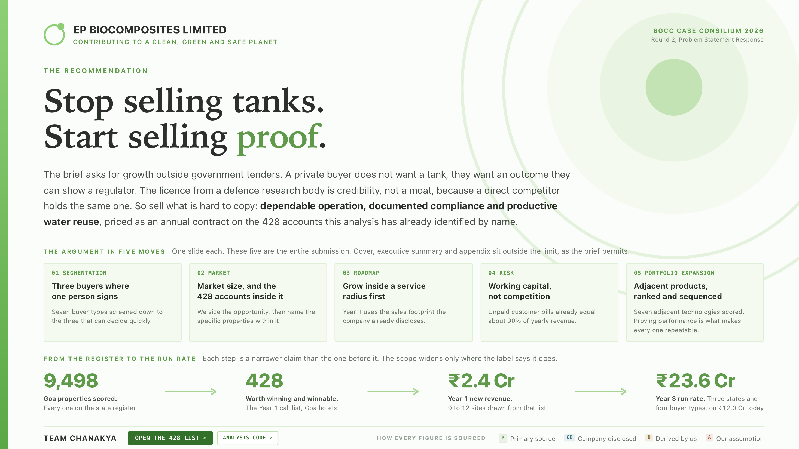
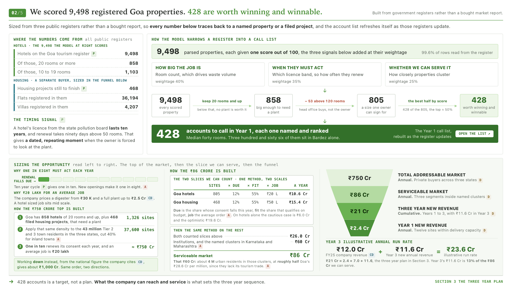
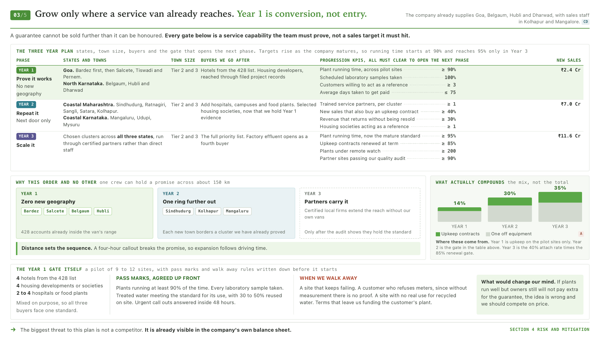

# JalPulse: the analysis behind the EPBL Case Consilium 2026 submission

This repository is the evidence trail behind Team Chanakya's submission to
**BGCC Case Consilium 2026, Round 2**, on EP Biocomposites Ltd (EPBL),
bio digester toilets and decentralised sewage and effluent treatment,
growing outside government tenders into private buyers across Tier 2/3
Goa, Maharashtra and Karnataka.

**The argument the deck makes:** EPBL's DRDO bio digester licence is
credibility, not a moat. A direct competitor holds the same one. The
defensible position is the thing most of the market currently fails at,
dependable operation, documented compliance and productive water reuse.
This repository is the tool that finds *which* properties that argument
should be aimed at, and proves the number on the deck's cover slide is
real.

Nothing here is typed from memory. Every figure in the deck, the account
counts, the revenue scenarios, the regulatory findings, the competitor
claims, is produced by running this pipeline against public sources, and
running it again reproduces every one of them.

## Table of Contents

- [The submission](#the-submission)
- [Walkthrough video](#walkthrough-video)
- [The two things this pipeline builds](#the-two-things-this-pipeline-builds)
- [Headline results](#headline-results-from-the-current-run)
- [Pipeline stages](#pipeline-stages)
- [Project layout](#project-layout)
- [Sources](#sources-see-configsources-for-exact-urls)
- [Evidence tagging convention](#evidence-tagging-convention)
- [The JalPulse score, briefly](#the-jalpulse-score-briefly)
- [Known limitations](#known-limitations-stated-plainly-not-buried)

## The submission

**[CaseConsilium_Chanakya.pdf](CaseConsilium_Chanakya.pdf)** is the
8-page deck this repository backs. Five sections, one slide each, cover
the buyer segmentation, the market sizing behind the 428-account list,
the three year rollout, the risk register and the portfolio expansion
options, with a cover, executive summary and sourced appendix around
them.

**[BGCC Case Round 2.pdf](BGCC%20Case%20Round%202.pdf)** is the original
problem statement issued by BITS Goa Consulting Club, included for
context on the brief the deck answers.







## Walkthrough video

<video src="CaseConsilium_Chanakya.mp4" controls width="100%"></video>

A short walkthrough of the recommendation and the evidence behind it. If
the player above doesn't load, [download the video directly](CaseConsilium_Chanakya.mp4).

## The two things this pipeline builds

1. **JalPulse**, an account-ranking model that scores every registered
   property in Goa on three signals (how big the job is, when the owner
   is next forced to act and how cheaply the property can be served),
   then narrows 9,498 properties down to the specific accounts worth
   calling in Year 1.
2. **The evidence log**, every disclosed fact pulled from EPBL's own
   filings and from four government and regulatory sources, each tagged
   so a reader can tell a verified number from an assumption at a
   glance.

The deck itself never leads with the name "JalPulse". It defines the
model in plain English first, then uses the name as shorthand. This
repository does the same: read the docstring in `src/score.py` before
treating a column name as self-explanatory.

## Headline results (from the current run)

| | |
|---|---|
| Properties on the Goa tourism register, scored | **9,498** (of 9,536 listed, 99.6% coverage) |
| Score in the top 5% by value | 481 |
| Inside the 20-120 room "owner can personally sign" band | 805 |
| **Both**, worth winning *and* actually winnable | **428** |
| Of which sit in Bardez taluka alone | 366 (85.5%) |
| Annual value of the Goa hospitality slice (bear / base / bull) | ₹6.0 Cr / ₹10.6 Cr / ₹19.6 Cr |
| Total addressable market, three states, non-government, Tier 2/3 (bottom-up) | approx. ₹750 Cr/yr |
| What EPBL can serve with its current three buyer types | approx. ₹86 Cr/yr |
| What the three year plan can actually deliver | ₹21 Cr cumulative, ₹11.6 Cr/yr run rate by Year 3 |
| Year 1 pilot capture (9-12 sites) | ₹2.4 Cr |

Every one of these numbers is reproduced by `python run_all.py` on a
clean checkout. See [`reports/jalpulse_summary.md`](reports/jalpulse_summary.md)
and [`reports/evidence_log.md`](reports/evidence_log.md) for the full
detail and traceability behind each.

## Pipeline stages

```
fetch  ->  extract  ->  score  ->  report
```

| Stage | Module | Reads | Writes |
|---|---|---|---|
| 1. Fetch | `src/fetch.py` | source URLs (`config.SOURCES`) | `data/raw/sources/*.pdf` / `*.html` (gitignored, re-fetched, not versioned) |
| 2. Extract | `src/extract.py` | cached raw sources | `data/raw/*.csv` (structured, **unscored**) |
| 3. Score | `src/score.py` | `data/raw/goa_hotels_raw.csv` | `data/processed/*.csv` (the JalPulse cuts) |
| 4. Report | `src/report.py` | everything above | `reports/*.md` |

Each stage is independently runnable (`python -m src.fetch`,
`python -m src.extract`, `python -m src.score`, `python -m src.report`)
and only depends on the previous stage's *output files*, so you can
re-score with different weights without re-fetching or re-extracting
anything. This is also why the pipeline is split into a `src/` package
rather than one script: `run_all.py` and the notebook both import the
same four modules and call them stage by stage, so the two entry points
can never drift apart.

## Project layout

```
config.py               <- single source of truth: URLs, paths, every
                            scoring weight/threshold, evidence tags
run_all.py               <- orchestrates all four stages end to end
requirements.txt
src/
  fetch.py                <- stage 1: download raw sources
  extract.py               <- stage 2: raw sources -> structured raw CSVs
  score.py                 <- stage 3: the JalPulse scoring engine
  report.py                <- stage 4: Markdown report generation
notebooks/
  JalPulse_Analysis.ipynb  <- same pipeline, interactive, cell by cell
data/
  raw/
    sources/                <- cached downloads (gitignored)
    goa_hotels_raw.csv        <- every registry row, unscored
    epbl_facts_raw.csv        <- key disclosed facts from EPBL's annual report
    drdo_licence_raw.csv      <- the DRDO licence certificate-table facts
    gspcb_rules_raw.csv       <- GSPCB Consent-to-Operate rules
    rera_mis_raw.csv          <- Goa RERA live dashboard figures
  processed/
    jalpulse_scored_full.csv          <- every property, every JalPulse column
    jalpulse_phase1_shortlist.csv      <- the 20-120 room decision-fit band (805)
    jalpulse_priority_and_winnable.csv <- the deck's headline list (428)
    taluka_tier_summary.csv            <- tier counts by district/taluka
reports/
  jalpulse_summary.md      <- findings, ready to drop into slide notes
  evidence_log.md          <- every fact, tagged [P]/[CD]/[D]/[A]
images/                     <- deck slide exports embedded in this README
CaseConsilium_Chanakya.pdf <- the submission deck
CaseConsilium_Chanakya.mp4 <- walkthrough video
BGCC Case Round 2.pdf      <- the original problem statement
```

## Sources (see `config.SOURCES` for exact URLs)

| Source | Tag | What it feeds |
|---|---|---|
| Goa Dept. of Tourism, registered-properties list | `[P]` | The entire scored universe, rooms, taluka, district |
| Goa RERA, live MIS dashboard | `[P]` | Developer-segment sizing (pending projects, flats, villas) |
| Goa State Pollution Control Board, Consent-to-Operate standard | `[P]` | The timing signal, licence validity years, room-count renewal thresholds |
| EP Biocomposites Ltd, 6th Annual Report FY24-25 | `[CD]` | Revenue, receivables, the Digital Paani/Bactreat partnerships, the subscription pilot, sales footprint |
| EP Biocomposites Ltd, prospectus | `[CD]` | The DRDO licence certificate table (issue/expiry dates) |

Four named competitors (Banka BioLoo, ECOSTP, CDD India, SUSBIO) are
referenced on the deck's portfolio slide. Their figures are
company-published claims gathered from public sources, not independent
audits.

## Evidence tagging convention

Used throughout `config.py`, the CSVs and the reports:

- **[P]**, primary or regulatory source (government registry, PCB circular, live dashboard)
- **[CD]**, company-disclosed (EPBL's own filings)
- **[D]**, derived by this pipeline from [P]/[CD] data
- **[A]**, a stated assumption (for example scoring weights, the 20-120 room "decision-fit" band)

Carry these tags onto the deck itself. Never let a `[D]` or `[A]` number
read as if it were `[P]`.

## The JalPulse score, briefly

Three signals per property, weighted into `value_score` (weights live in
`config.py`, never hardcoded twice):

1. **Commercial value** `[P]`, log-scaled room count (how big the job is).
2. **Regulatory urgency** `[P, D]`, GSPCB's own Consent-to-Operate size
   bands: hotels above 50 rooms are explicitly "Large Category" (90-day
   renewal processing), 20-50 rooms is "Micro/Small" (60-day). All hotel
   CTOs are assumed Orange-category (10-year validity) `[A]`, since
   per-property pollution category isn't published in the tourism
   registry.
3. **Serviceability** `[P, D]`, taluka cluster density, derived from the
   registry's own concentration (Bardez > Salcete/Pernem/Tiswadi > rest).

A separate **decision-fit** factor `[A]` (room-count band as a proxy for
"an independent owner can sign this, it isn't a corporate-procured
chain") discounts `value_score` into `phase1_score`. This matters: the
unfiltered top of the register is dominated by branded international
chains (Marriott, Hyatt, Westin, Novotel) that go through head-office
procurement, not an on-site owner. **The deck's headline "428" is the
intersection** of top-tier `value_score` *and* the decision-fit band,
see `build_priority_and_winnable()` in `src/score.py`, deliberately, so
a large branded chain scoring high on raw value never gets counted as a
winnable Year 1 account.

**Change an assumption, re-run `run_all.py`, every CSV, report and the
number on the deck's cover slide update together.**

## Known limitations (stated plainly, not buried)

- **Row-extraction coverage is approx. 99.6%, not 100%.** The registry
  PDF has layout quirks (see the comment above `ROW_RE` in
  `src/extract.py`) that a small number of rows still don't survive. The
  verified aggregates (858 properties 20 rooms or more, 1,103 at 10-19
  rooms) are stable across the fixes already applied. The residual gap
  is scattered, not concentrated in one segment.
- **`name_confidence="low"`** flags rows where the name-extraction
  heuristic likely mis-split the name from the address. Don't quote a
  low-confidence name in outreach or on a slide without checking the
  source row by hand.
- **The timing signal is a real regulatory cadence, not a per-property
  date.** GSPCB publishes the renewal *cycle* (10 years, Orange
  category), not each property's actual consent date, so "years until
  renewal" isn't computable per property yet. That would be the single
  highest-value data addition if EPBL's own sales team can access
  GSPCB's consent-order filings.
- **`decision_fit` is a stated proxy, not verified ownership data.**
  Room-count bands correlate with likely independent ownership but
  aren't a ground-truth check. A handful of properties in the 428 may
  still turn out to be franchise or chain-managed on closer look.
- **The Goa RERA MIS numbers are a live counter.** Re-running `fetch`
  after the case deadline will pull different (larger) figures. Note the
  fetch date recorded alongside the numbers.
- **The total-market figure (₹750 Cr) is reasoned, not counted.** It
  scales Goa's own verified property density across the Tier 2/3 urban
  population of the three states, discounted for towns without Goa's
  tourism intensity. Only the serviceable (₹86 Cr) and deliverable
  (₹21 Cr / ₹2.4 Cr) figures are built directly from named properties.
- **EPBL discloses no revenue split by product line.** Its FY24-25
  revenue is one line item (goods and services), so the deck's revenue
  bridge works from total company revenue rather than a
  water-treatment-only figure, stated on the appendix slide rather than
  estimated here.
- **Scope**: this pipeline currently covers Goa only. Extending to North
  Karnataka and Maharashtra Year 2/3 clusters needs equivalent tourism,
  RERA and PCB sources for those states, which are not yet wired into
  `config.SOURCES`.
